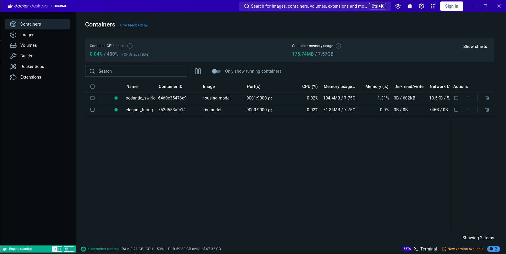
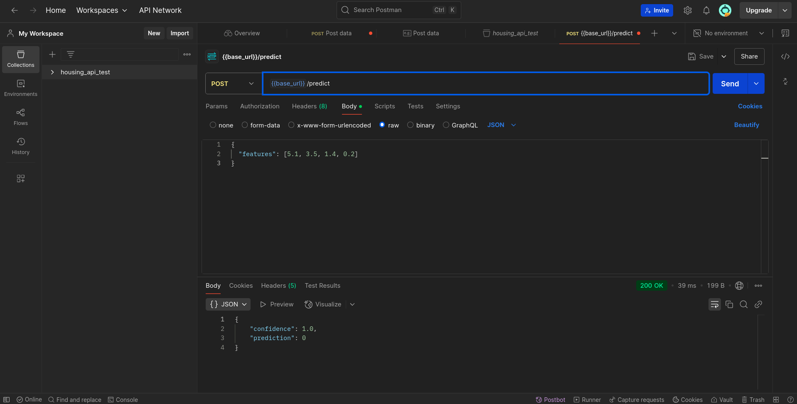
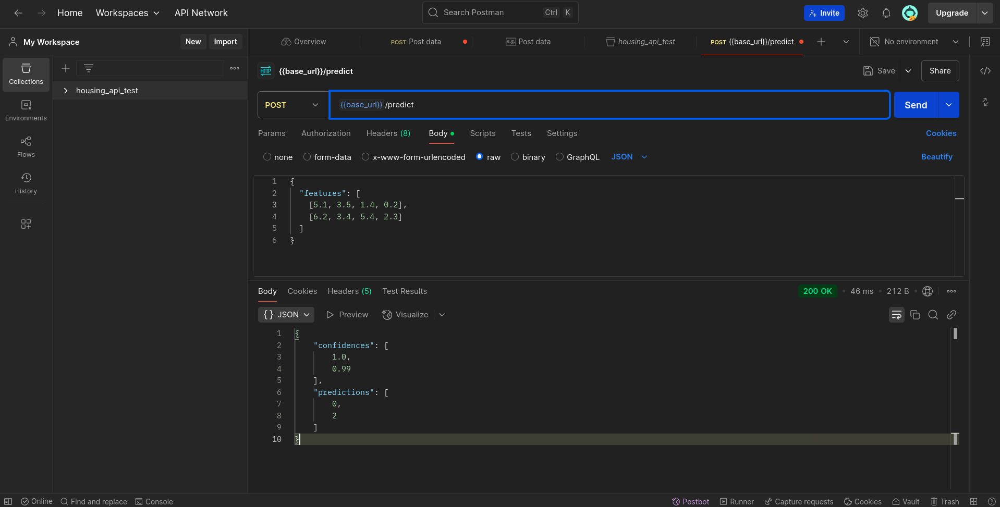
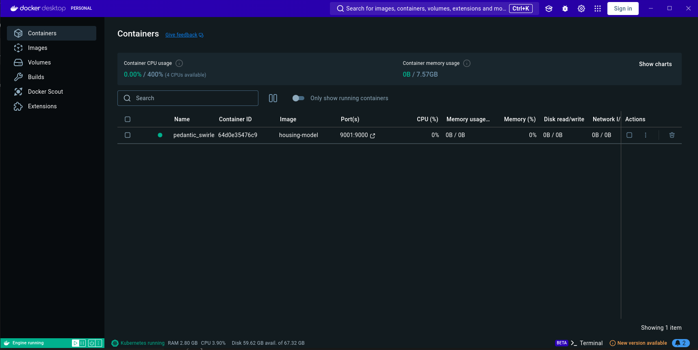
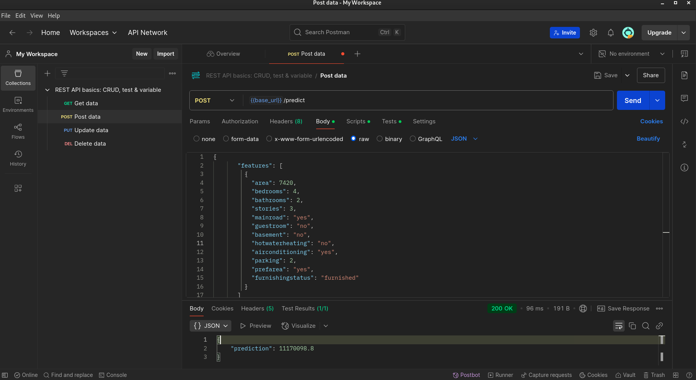
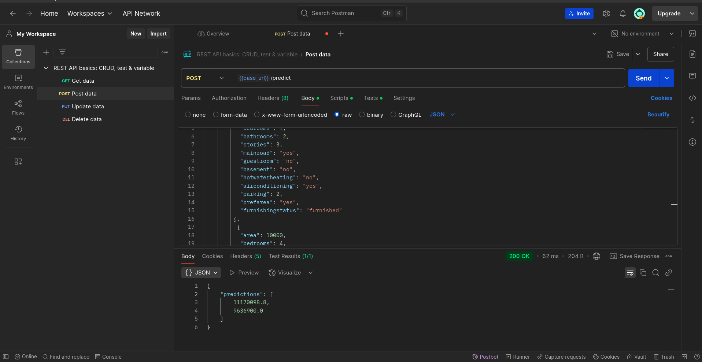

# ML Model Deployment with Docker

This project demonstrates the deployment of machine learning models as REST APIs using Flask and Docker. It includes two models:

1. Iris Flower Classification Model
2. Housing Price Prediction Model

## Project Structure

```
.
├── app/
│   ├── app.py                   # Iris classification API
│   ├── housing_app.py           # Housing price prediction API 
│   ├── requirements.txt         # Required Python dependencies
│   ├── model.pkl                # Trained Iris classification model
│   ├── housing_model.pkl        # Trained housing price model
│   └── housing_model_info.pkl   # Housing model metadata
├── Dockerfile                   # Dockerfile for Iris model
├── housing_dockerfile           # Dockerfile for Housing model
├── train.py                     # Script to train Iris model
├── train_housing.py             # Script to train Housing model
└── Housing.csv                  # Housing dataset
```

## Setup Instructions

### Prerequisites
- Docker
- Python 3.9+

### Training Models
To train the models, run:

```bash
# Train Iris classification model
python train.py

# Train Housing price prediction model
python train_housing.py
```

### Building and Running Docker Containers

#### Iris Classification Model

```bash
# Build the Docker image
docker build -t iris-model .

# Run the container
docker run -p 9000:9000 iris-model
```

#### Housing Price Prediction Model

```bash
# Build the Docker image
docker build -t housing-model -f housing_dockerfile .

# Run the container
docker run -p 9001:9000 housing-model
```

## API Documentation

### Iris Classification Model

#### Endpoints

1. GET `/` - Home
   - Returns a simple message indicating the API is running

2. GET `/health` - Health Check
   - Returns: `{"status": "ok"}`

3. POST `/predict` - Predict Iris Species
   - Input (single sample):
     ```json
     {
       "features": [5.1, 3.5, 1.4, 0.2]
     }
     ```
   - Output:
     ```json
     {
       "prediction": 0,
       "confidence": 0.97
     }
     ```

   - Input (multiple samples):
     ```json
     {
       "features": [
         [5.1, 3.5, 1.4, 0.2],
         [6.2, 3.4, 5.4, 2.3]
       ]
     }
     ```
   - Output:
     ```json
     {
       "predictions": [0, 2],
       "confidences": [0.97, 0.95]
     }
     ```

### Housing Price Prediction Model

#### Endpoints

1. GET `/` - Home
   - Returns a simple message indicating the API is running

2. GET `/health` - Health Check
   - Returns: `{"status": "ok"}`

3. GET `/model_info` - Model Information
   - Returns information about the model features and structure

4. POST `/predict` - Predict Housing Price
   - Input (using dictionaries):
     ```json
     {
       "features": [
         {
           "area": 7420,
           "bedrooms": 4,
           "bathrooms": 2,
           "stories": 3,
           "mainroad": "yes",
           "guestroom": "no",
           "basement": "no",
           "hotwaterheating": "no",
           "airconditioning": "yes",
           "parking": 2,
           "prefarea": "yes",
           "furnishingstatus": "furnished"
         }
       ]
     }
     ```
   - Output:
     ```json
     {
       "prediction": 13300000
     }
     ```

   - Input (using array values in order):
     ```json
     {
       "features": [
         [7420, 4, 2, 3, "yes", "no", "no", "no", "yes", 2, "yes", "furnished"]
       ]
     }
     ```
   - Output:
     ```json
     {
       "prediction": 13300000
     }
     ```

## Input Validation

The APIs validate all inputs and return clear error messages with HTTP 400 status codes for invalid requests.


--- 
# Test Results

## Iris Classification Model

### Test Results for Iris Classification Model

#### Test 0: Docker Test
  

#### Test 1: Single Prediction with Dictionary Input

**Input:**

```json
{
  "features": [
    [5.1, 3.5, 1.4, 0.2]
  ]
}
```

**Output:**

```json
{
    "confidence": 1.0,
    "prediction": 0
}
```

**Actual Output:**


### Test 2: Batch Predictions with List Input

**Input:**

```json
{
  "features": [
    [5.1, 3.5, 1.4, 0.2],
    [6.2, 3.4, 5.4, 2.3]
  ]
}
```

**Output:**

```json
{
    "confidences": [
        1.0,
        0.99
    ],
    "predictions": [
        0,
        2
    ]
}
```

**Actual Output:**


## Housing Price Prediction Model

## Test Results for Housing Price Prediction Model

### Test 0: Docker Test


### Test 1: Single Prediction with Dictionary Input

**Input:**

```json
{
       "features": [
         {
           "area": 7420,
           "bedrooms": 4,
           "bathrooms": 2,
           "stories": 3,
           "mainroad": "yes",
           "guestroom": "no",
           "basement": "no",
           "hotwaterheating": "no",
           "airconditioning": "yes",
           "parking": 2,
           "prefarea": "yes",
           "furnishingstatus": "furnished"
         }
       ]
     }
```

**Output:**

```json

{
    "prediction": 11170098.8
}
```

**Actual Output:**



### Test 2: Batch Predictions with Dictionary Input

**Input:**

```json
{
       "features": [
         {
           "area": 7420,
           "bedrooms": 4,
           "bathrooms": 2,
           "stories": 3,
           "mainroad": "yes",
           "guestroom": "no",
           "basement": "no",
           "hotwaterheating": "no",
           "airconditioning": "yes",
           "parking": 2,
           "prefarea": "yes",
           "furnishingstatus": "furnished"
         },
          {
           "area": 10000,
           "bedrooms": 4,
           "bathrooms": 2,
           "stories": 2,
           "mainroad": "yes",
           "guestroom": "no",
           "basement": "no",
           "hotwaterheating": "no",
           "airconditioning": "yes",
           "parking": 2,
           "prefarea": "yes",
           "furnishingstatus": "furnished"
         }
       ]
     }
```

**Expected Output:**

```json

{
    "predictions": [11170098.8, 11170098.8],
}
```

**Actual Output:**
